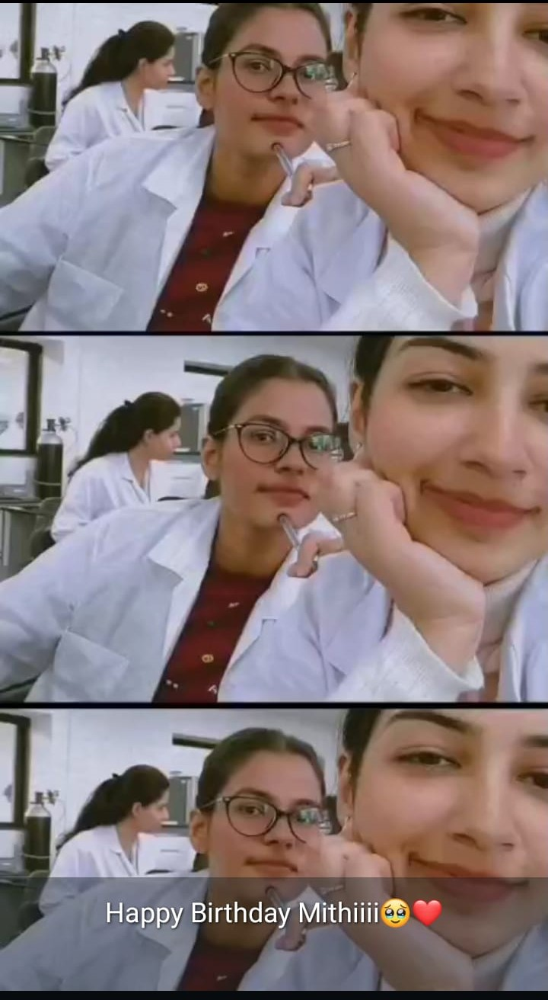

<!DOCTYPE html>
<html lang="en">
<head>
  <meta charset="UTF-8">
  <meta name="viewport" content="width=device-width, initial-scale=1">
  <title> Birthday Wishes</title>
  
</head>
<body>

  <h1>🎉 Happy Birthday Miss beauty! 🎂</h1>
  
Wishing you a day filled with laughter, love, and endless joy — even before it arrives!

  
Here’s a little preview of the fun and memories coming your way! 🥳

  

    

    

    

    

  

  <footer>
    Created with 💖 just for you!
  </footer>

  <button class="btn" onclick="alert('🎉 Surprise! A gift is waiting for u! 🎉')">
    Click for a Surprise!
  </button>

</body>
</html>
